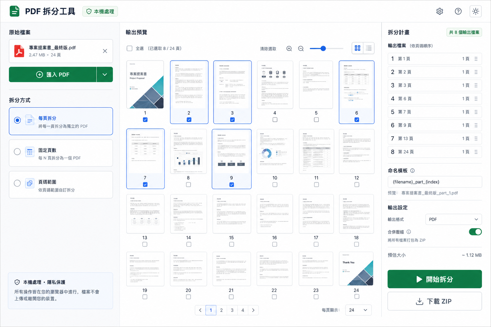

# PDF 拆分工具

一個隱私優先、可離線安裝的 PDF 拆分 PWA。所有 PDF 解析、預覽、拆分與 ZIP 打包均在使用者瀏覽器中完成，檔案不會上傳到伺服器。



## 功能

- 拖放或選擇一至多份 PDF，依匯入順序合併並顯示各來源頁數。
- 依可視區域延遲產生頁面縮圖，限制同時渲染數量。
- 來源頁與分件清單採虛擬滾動，只渲染可視範圍及少量 overscan 項目。
- 依固定頁數拆分，或以拖曳方式建立自訂頁碼範圍；固定頁數設為 1 即逐頁拆分。
- 執行前預覽輸出分件與選取頁面。
- 支援跨分件拖曳、分件內排序與新增自訂範圍。
- 支援鍵盤方向鍵瀏覽來源頁，以及在分件內重新排序或跨分件移動。
- 可點擊縮圖左上角的 X，或將頁面拖回左側來源頁區，從目前分件移除。
- 使用命名模板產生輸出名稱。
- 下載個別 PDF 或將全部結果打包成 ZIP。
- 自動檢查空分件、重複頁面與輸出檔名衝突。
- Service Worker 預快取前端與 PDF.js worker、版本更新提示，可安裝並離線處理。
- 響應式三欄介面與明暗模式。

## 操作流程

1. **匯入檔案**：選取或拖入一至多份 PDF；多份來源會依匯入順序合併。
2. **檔案拆分命名**：使用積木調整輸出檔名，可加入原檔名、流水號、頁碼與日期。
3. **拆分工作台**：選擇固定頁數或頁碼範圍，確認分件後下載個別 PDF 或 ZIP。

### 固定頁數

- 設定每份 PDF 包含的頁數。
- 設為 `1` 時等同逐頁拆分。
- 可在產生分件後繼續拖曳調整頁面順序。

### 頁碼範圍

- 此模式不提供 `1-3, 5, 8-10` 文字輸入框，改用縮圖拖曳分組。
- 點擊「新增自訂範圍」建立空分件，再將左側來源頁或其他分件頁面拖入。
- 將滑鼠移到分件縮圖上會顯示左上角 X；點擊可移除該頁。
- 也可把分件頁面拖回左側來源頁區移除。
- 空分件的警告會顯示在該分件內，且無法下載 ZIP。
- 「刪除」按鈕會刪除整個分件；「下載 PDF」只下載該分件。

## 隱私聲明

此工具採純前端架構，不提供文件上傳 API。PDF 只會存在目前瀏覽器工作階段的記憶體中。清除工作區、重新整理或關閉頁面後，應用程式不會保留來源 PDF。

請注意：網站程式本身由 GitHub Pages 提供；使用者選取的 PDF 不會傳送給 GitHub。

## 技術棧

- Node.js 25.8.2
- TypeScript 7
- React 19
- Vite 8（Hot Module Replacement）
- ESLint 9
- PDF.js：解析與縮圖
- pdf-lib：頁面擷取與輸出
- JSZip：ZIP 打包
- Web Worker：將多檔 PDF 合併、PDF 拆分與 ZIP 壓縮移出 UI 主執行緒
- TanStack Virtual：來源頁與分件清單虛擬化
- vite-plugin-pwa / Workbox：PWA 與離線快取
- Vitest / Testing Library：領域、PDF/ZIP 整合、效能基準及工作區競態測試
- Playwright / axe-core：主要流程 E2E 與 WCAG A/AA 自動檢查

> TypeScript 7 已正式發布，但目前 `typescript-eslint` 尚無法在 TS 7 執行。本專案使用 Babel TypeScript parser 執行 ESLint，並由正式 TypeScript 7 的 `tsc -b` 負責嚴格型別檢查。

## 系統需求

- Node.js `25.x`（建議依 `.nvmrc` 使用 `25.8.2`）
- npm `11.10.0`（由 `packageManager` 固定）
- 現代瀏覽器：Chrome、Edge、Firefox 或 Safari

## 開發

```powershell
npm.cmd install
npm.cmd run dev
```

Vite 開發伺服器預設位於 `http://localhost:5173`，修改 TypeScript、React 或 CSS 後會自動熱更新。

## 驗證

```powershell
npm.cmd run lint -- --fix
npm.cmd run lint
npm.cmd run test
npm.cmd run build
npm.cmd run test:e2e
```

正式輸出位於 `dist/`。

目前驗證基準為 14 個 Vitest 測試檔、43 個測試案例，以及 8 個 Playwright E2E 案例；E2E 預設涵蓋 Chromium、Firefox 與 WebKit，Service Worker 離線處理情境在 Chromium 驗證。`build` 會額外檢查 bundle 大小預算；lint 採零警告門檻，且 `src` 下的 TypeScript、TSX、CSS 均不得超過 300 行。

## 專案結構

```text
src/
├── domain/              # 拆分規則、計畫驗證、輸出唯一命名
├── application/         # 工作階段、匯入競態與縮圖佇列
├── infrastructure/      # PDF.js、pdf-lib、JSZip 與背景 Worker 介接
├── workers/             # PDF 合併、拆分與 ZIP 壓縮 Worker
├── components/          # 匯入、命名、頁池、分件與拖曳 UI
├── styles/              # 依責任拆分的樣式區段
├── test/                # Vitest 共用設定
├── App.tsx
└── main.tsx             # React 與 PWA Service Worker 入口
```

專案根目錄另包含 `e2e/` Playwright 測試、`scripts/check-file-lines.mjs` 行數門檻，以及 `scripts/check-bundle-size.mjs` 產物大小預算。

跨模組匯入統一使用 `@/` 指向 `src/`，不使用多層 `../../` 相對路徑。

領域規劃、驗收條件及後續里程碑請見 [`issue.md`](./issue.md)。

## 架構與資料流

```text
React UI
  -> usePdfWorkspace
     -> PageRef registry 與拆分計畫
     -> 延遲縮圖佇列（最多同時 2 個）
     -> 獨立輸出進度 store
     -> pdf-service
        -> PDF.js Worker：解析與縮圖
         -> PDF merge Worker：多檔合併與頁數限制
         -> PDF output Worker：pdf-lib 拆分
        -> ZIP output Worker：JSZip 壓縮
```

正式瀏覽器使用 Worker；測試環境或不支援 Worker 的瀏覽器使用相同核心函式的 fallback，避免產生兩套行為。縮圖會依裝置像素比產生，並限制最多 160 張 Blob URL 快取。

## 拆分規則

固定頁數必須是大於 0 的整數；設定為 1 時，每一頁會輸出成一份 PDF。頁碼範圍模式以拖曳分組操作，不提供文字範圍輸入。每個輸出分件至少需要一頁，同一頁不可同時存在於多個分件。

來源頁面以穩定 `PageRef` 保存來源檔 ID、來源頁碼、合併文件頁碼及旋轉角度。左側來源頁取得焦點後可用方向鍵導覽；右側展開縮圖後，可用左右方向鍵排序、上下方向鍵移至相鄰分件，操作結果會透過 live region 公告。

命名模板支援：

- `{originalName}`
- `{partNumber}`
- `{startPage}`
- `{endPage}`
- `{date}`

即使模板未包含 `{partNumber}`，系統也會為重複名稱追加後綴，避免 ZIP 內的 PDF 互相覆蓋。

## 部署到 GitHub Pages

專案使用 GitHub Pages 作為唯一正式發布路徑，包含兩個 GitHub Actions workflow：

- `.github/workflows/quality.yml`：Pull Request 執行安裝、lint、test、build、跨瀏覽器 E2E。
- `.github/workflows/deploy-pages.yml`：`main` 通過相同驗證後將 `dist/` 部署至 GitHub Pages。

1. 在 GitHub 建立 repository 並推送到 `main`。
2. 開啟 repository 的 **Settings → Pages**。
3. 將 **Source** 設成 **GitHub Actions**。
4. 推送後等待 `Deploy PWA to GitHub Pages` 工作流程完成。

Vite 使用相對 `base`，PWA manifest、Service Worker 與資源路徑可在 `https://<user>.github.io/<repo>/` 子路徑運作。建置只產生標準 `dist/`，不包含其他託管平台的 Worker 或 server 產物。

若開發期間看到舊版 UI，可先按 `Ctrl+F5` 強制重新整理。正式 PWA 偵測到新版時會顯示更新提示；更新頁面會清除尚未下載的工作階段資料。

## 已知限制

- 多份來源會先合併成同一工作文件，不是彼此獨立的批次工作。
- 加密 PDF 尚未提供密碼輸入介面。
- 大型 PDF 的輸出運算仍可能受瀏覽器記憶體限制。
- 單次匯入總容量上限為 200 MB，合併後總頁數上限為 2,000 頁。
- 達 50 MB 或 500 頁時會顯示大型文件提示。
- Web Worker 可避免 UI 長時間凍結，但瀏覽器仍需保留輸入、合併結果、拆分結果及 ZIP 所需記憶體；下載 ZIP 成功後會釋放暫存輸出。
- 鍵盤移動目前以相鄰頁面或相鄰分件為單位；跨多個分件仍需重複操作。

## 瀏覽器驗證矩陣

| 瀏覽器 | 自動驗證 | 備註 |
| --- | --- | --- |
| Chromium | Playwright E2E | PR 與部署 workflow 必跑；含離線 PDF 流程 |
| Firefox | Playwright E2E | PR 與部署 workflow 必跑 |
| WebKit / Safari | Playwright WebKit E2E | PR 與部署 workflow 必跑；iOS 仍需發布前手動驗證 |
| Chrome / Edge | 手動煙霧測試 | 共用 Chromium 核心 |

## 疑難排解

- 看見舊版介面：重新載入後接受更新提示；必要時清除網站資料與 Service Worker。
- PDF 無法匯入：確認副檔名、PDF 標頭、200 MB／2,000 頁上限及是否為受密碼保護的文件。
- 大型文件處理緩慢：關閉其他高記憶體分頁，保持目前頁面開啟，並優先分批處理。
- GitHub Pages 空白：確認 Pages Source 為 GitHub Actions，且 workflow 的 lint、test、build、E2E 均通過。

安全問題的私下回報方式與信任邊界請見 [`SECURITY.md`](./SECURITY.md)。

## 授權與第三方套件

發布前請依產品授權策略新增專案 `LICENSE`。第三方套件授權以各套件發布內容為準；分發時應保留相應授權聲明。
